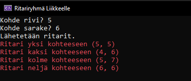
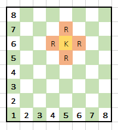

# C#-ohjelmointihaasteet

## 1. Neljä karhua ja kissa

### Kuvaus

“Metsässä elää neljä karhua he kalastavat joella joka päivä. He laittavat päivän saaliinsa joka päivä tasan. Jokainen karhu saa saman määrän kalaa. Joskus päivä saalis ei mene tasan ja he antavat jäljelle jääneen saaliin metsässä asustavalle kissalle. Tee ohjelma mikä laskee montako kalaa kukin karhu saa ja monta jää mahdollisesti kissalle.”

### Tehtävä

Ohjelma pyytää käyttäjältä numeron, kuinka monta kalaa karhut ovat päivän aikana kalastaneet
Käytä / ja % operaattoreita laskeaksesi montako kalaa kukin karhu saa ja montako he antavat kissalle
Tulosta kalamäärät karhuille ja kissalle
Vastaa kysymykseen: on olemassa kolme kala määrää missä kissa saa enemmän kalaa kuin karhut, mitkä ovat nämä määrät? Käytä tekemääsi ohjelmaa apuna.

## 2. Valtakuntien herruus

### Kuvaus

Olet mukana tekemässä strategiapeliä ja saat tehtäväksesi koodata pelaajien pisteen laskun. Pelissä pelaajat hallitsevat eri alueita, mitkä jakautuvat seuraaviin: maatilat, herttuakunnat ja maakunnat. Pelaajien pisteet määräytyvät montako eri aluetta heillä on hallussaan. Maatiloista saa yhden (1) pisteen, herttuakunnista kolme (3) ja maakunnista kuusi (6). Ohjelmoi pelin osa, missä lasketaan pelaajan pisteet.

### Tehtävä

Ohjelmaan syötetään montako maatilaa, herttuakuntaa ja maakuntaa pelaajalla on
Ohjelma laskee montako pistettä pelaajalla on yhteensä. Maatila 1 piste, herttuakunta 3 pistettä ja maakunta 6 pistettä
Tulosta konsoliin yhteenlaskettu pistemäärä

## 3. Ritariryhmä liikkeelle

### Kuvaus

Teet taas ominaisuuden strategiapeliin. Tällä kertaa ritareiden (R) liikuttamiseen. Pelikenttänä toimii 8x8 ruudukko (samaan tyyliin kuin shakissa). Ritariryhmä liikkuu niin, että ritarit sijoittuvat kohderuudun (jossa Kuningas seisoo) ylä-, ja alapuolelle sekä oikealle ja vasemmalle. Ohjelmoipeliä niin, että kysyt pelaajalta kohde rivin ja sarakkeen. Tämän jälkeen tulosta mihin kukin ritari liikkuu. Alla esimerkki tulostus.

### Konsolissa ja visualisoitu (malliksi).

### Tehtävä

Kysy käyttäjältä kohde rivi ja sarake (kuvan K-kirjain)
Laske naapuri rivit ja sarakkeet mihin ritarit lähetetään (kuvan R-kirjaimet)
Tulosta ritareiden kohteet valitsemallasi värillä (esim. punaiseksi komennolla Console.ForegroundColor = ConsoleColor.Red)
Muuta ikkunan otsikoksi “Ritariryhmä Liikkeelle”. Käytä komentoa Console.Title = ""
Käytä Console.Beep() metodia kun ritarien kohteet tulostetaan

## 4. Vartiotorni

### Kuvaus

Strategiapeliin koodataan vartiotorni. Vartiotornin tulee varoittaa vihollisen liikkeistä ja kertoa mistä suunnasta vihollinen tulee.

### Tehtävä

Kysy käyttäjältä x ja y arvot. Käytetään näitä koordinaatioina mistä suunnasta vihollinen tulee
Kuvaa hyödyntäen tulosta oikea lause, perustuen mistä koordinaateista vihollinen tulee

Esimerkkitulostus:

## 5. Arvuutuskone

### Kuvaus

Tehdään ohjelma mihin osallistuu kaksi pelaajaa. Ensimmäinen pelaaja antaa numeron 1-100. Tämän jälkeen toinen pelaaja koittaa arvata numeroa.

Esimerkkituloste:

Tämän jälkeen hyvä tyhjentää konsoli (Vinkki: Console luokalla on metodi tähän)

### Tehtävä

Ensimmäinen pelaaja antaa numeron (1-100)
Jos numero on alle 1 ja yli 100 niin kysy uudestaan
Tyhjennä ruutu kun ohjelma on saanut hyväksytyn numeron
Kysy toiselta pelaajalta numeroa
Kerro toiselle pelaajalle jos numero on liian pieni tai liian suuri
Toista suoritusta kunnes toinen pelaaja arvaa oikein, tämän jälkeen lopeta ohjelma

## 6. Kanuuna

### Kuvaus

Strategiapeliin on tarkoitus toteuttaa puolustustorni. Torni on rakennettu taianomaisin voimin ja kykenee ampumaan elementti taikavoimilla voimistettuja ammuksia. Torni ampuu automaattisesti normaaleja ammuksia, mutta joka kolmas ammus on voimistettu Tuli elementellillä ja joka viides ammus taas Sähkö elementillä. Kun ammukset yhdistyvät torni ampuu mega-elementti ammuksen. Torni ampuu 100 ammusta kunnes se pitää taas ladata. Koodaa pelille torni.

### Esimerkki

### Tehtävä

Tee ohjelma mikä käy läpi numerot 1 -100 ja tulostaa minkä tyyppistä ammusta tykki ampuu
Joka 3. Tuli ja joka 5 Sähkö
Muuta tekstin väriä sen perusteella minkä ammuksen tykki ampuu (Esim. Tuli punainen, Sähkö keltainen ja molemmat sininen)
esim. punaiseksi muutetaan komennolla Console.ForegroundColor = ConsoleColor.Red

## 7. Kivi, paperi, sakset

### Kuvaus

Kivi, paperi ja sakset on tunnettu kahden tai useamman osanottajan leikki tai peli. Kirjoita ohjelma, jossa pelataan tietokonetta vastaan.

Voittaja ratkeaa seuraavan kaavan mukaisesti:

Kivi voittaa sakset (kivellä voi rikkoa sakset eikä saksilla voi leikata kiveä)
Paperi voittaa kiven (kiven voi peittää paperilla)
Sakset voittaa paperin (saksilla voi leikata paperia)
Mikäli molemmat saavat saman, tilanne on tasapeli ja pelikierros uusitaan.

Ohjelman kulku olkoon seuraava:

Tietokone aloittaa kysymällä: 1 = Kivi, 2 = Paperi, 3 = Sakset ?
Pelaaja valitsee yhden vaihtoehdoista, johon tietokone vastaa omalla valinnalla.
Ohjelma julistaa voittajan

## 8. Lihapiirakkaongelma

### Kuvaus

Koodaa ohjelma, joka kysyy käyttäjältä lompakossa olevan rahamäärän ja lihapiirakan hinnan. Ohjelma tutkii, onko käyttäjällä varaa ostaa lihapiirakka. Jos on, niin ohjelma ilmoittaa kuinka paljon lompakkoon jää vielä rahaa. Muussa tapauksessa ohjelma kehottaa käyttäjää paastoamaan.

## 9. Arvosanat

### Kuvaus

Kooda ohjelma, joka ilmoittaa numeerisen arvosanan sanallisen kuvauksen, kun ohjelmalle annetaan syötteenä numeerinen arvosana. Mikäli käyttäjän antama syöte ei ole välillä 0 – 5, ohjelma antaa virheilmoituksen
Numeerisia arvosanoja vastaavat sanalliset arviot ovat seuraavat:

0 : hylätty
1 : välttävä
2 : tyydyttävä
3 : hyvä
4 : kiitettävä
5 : erinomainen

## 10. PIN- ja PUK-koodit

### Kuvaus

Koodaa ohjelma, joka ohjelman käynnistyessä kysyy nelinumeroisen PIN koodin. Jos PIN koodi annetaan kolme kertaa väärin ohjelma ilmoittaa siitä ja pyytää syöttämään 8 numeroisen PUK koodin (Personal Unblocking Key). Jos PUK koodin syöttää väärin kolme kertaa ohjelman toiminta keskeytyy.

HUOM! PIN ja PUK koodit voivat alkaa myös nollalla (esim. 0439, 06768023)

## 11. Vastaluku

### Kuvaus

Kooda metodi, joka muuttaa kaikki taulukossa olevat luvut vastaluvuikseen.
Luvun x vastaluku on –x.

## 12. Kalorit vs. joulet

### Kuvaus

Koodaa ohjelma, jolla voi muuttaa annetut kalorit jouleiksi (J) ja joulet kaloreiksi (cal). Aluksi ohjelma kysyy käyttäjältä, kumman muunnoksen tämä haluaa tehdä, ja pyytää sitten joko joulemäärän tai kalorimäärän. Joulet voidaan muuntaa kaloreiksi kertomalla ne luvulla 0.2390 ja kalorit jouleiksi kertomalla ne luvulla 4.184. Tee valikko, josta käyttäjä voi valita kumman vaihtoehdon hän valitsee, esim. seuraavasti.

Valikko:

1. Kalorit jouleiksi
2. Joulet kaloreiksi

Valitse muunnos:

## 13. Numerot merkkijonoksi

### Kuvaus

Kun olet ratkaisut ohjelmointihaasteen, niin merkkaa se tehdyksi!

#### Vaihe 1.

Tee metodi, joka muuntaa tekstissä olevat numerot merkkijonoksi. Muunnettava teksti välitetään toisesta luokasta parametrinä ja metodi palauttaa muunnetun tekstin takaisin kutsuvalle luokalle.

#### Esimerkki:

Alkuperäinen teksti: Herra Huun osoite on tattisuonkatu 42 A 123.

Muutettu teksti: Herra Huun osoite on tattisuonkatu neljäkymmentä A satakaksikymmentäkolme.

#### Vaihe 2.

Sovella sitten metodia niin, että ohjelma lukee muunnettavan tekstin teksitiedostosta.

#### Vaihe 3.

Muunna ohjelmaa niin, että se tallentaa muunnetun tekstin tekstitiedostoon.

## EXTRA: ohjelmointihaaste

### Kuvaus

Luo pelin lopputaistelu lohikäärmeen kanssa. Pelissä lohikäärme lähestyy kaupunkia ja pelaajan puolustaa kaupunkia käyttämällä taikakanuunaa. Pelaajan tehtävä kukistaa lohikäärme ennen kuin se pääsee kaupunkiin ja tuhoaa sen. Mikäli pelaaja onnistuu tehtävässään pelaaja voittaa. Pelaaja häviää pelin mikäli lohikäärme pääsee kaupunkiin asti.

### Tehtävä

Määrittele pelin aloitus. Lohikäärme aloittaa 10 terveyspisteellä ja kaupunki 15. Peli alkaa kierroksella 1
Ensimmäinen pelaaja määrittelee lohikäärmeen etäisyyden kaupungista (numero 0 ja 100 välillä). Tyhjennä komentorivi tämän jälkeen
Pyöritä peliä silmukassa kunnes lohikäärmeen tai kaupungin terveyspisteet ovat 0
Jokaisen vuoron alussa tulosta komentoriville kierroksen numero, kaupungin ja lohikäärmeen terveyspisteet
Laske paljon vahinkoa kanuuna tekee jokaisella vuorolla: 10 pistettä jos kierrosluku on jaollinen 3 ja 5, 3 pistettä jos jaollinen 3 tai 5 (ei molemmat) ja muuten 1 pistettä
Pyydä toista pelaajaa antamaan kohde etäisyys (numero 0-100 välillä). Kerro pelaajalle oliko osuma yli, ali vai osuiko se lohikäärmeeseen. Jos ammus osui niin vähennä lohikäärmeen terveyspisteitä odotettu määrä
Kierroksen lopuksi, jos lohikäärme on vielä hengissä, vähennä kaupungilta yksi terveyspiste
Kun lohikäärmeen tai kaupungin terveyspisteet on 0 peli päättyy. Tulosta pelin lopputulos
Muuta komentorivin tekstien väriä riippuen mitä viestejä kommunikoit pelaajalle

### Vinkkejä:

Hyödynnä metodeja yhden ongelman ratkaisuun
Tämä versio tarvitsee 2 pelaajaa, jos haluat haastaa itsesi niin voit kokeilla korvata ensimmäisen pelaajan osuuden arvotulla numerolla
Kaikista aikasemmista C# tehtävistä on apua tämän tekemiseen, mutta erityisesti tehtävät: Tehtävä 10 – Ritariryhmä Liikkeelle, Tehtävä 14 – Arvuutuskone, Tehtävä 15 – Taikakanuuna

### Esimerkki

Alla kuva esimerkki konsolissa tapahtuvasta toiminnasta.

Ensimäisen pelaajan toiminto. Kysy uudestaan jos annettu numero ei ole 0-100 välillä.

Toisen pelaajan vuoro ja loppu peli. Pelaaja tähtää ja saa tietoon oliko osuma yli vai alle. Osumasta vahinkoa lohikäärmeeseen. Peli päättyy kun kaupungin tai lohikäärmeen terveyspisteet on 0.
